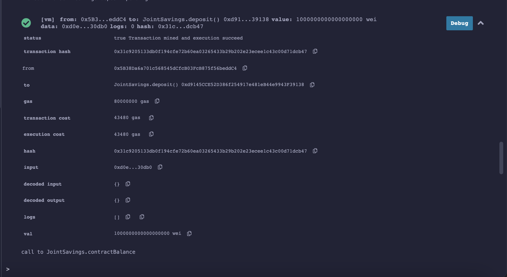
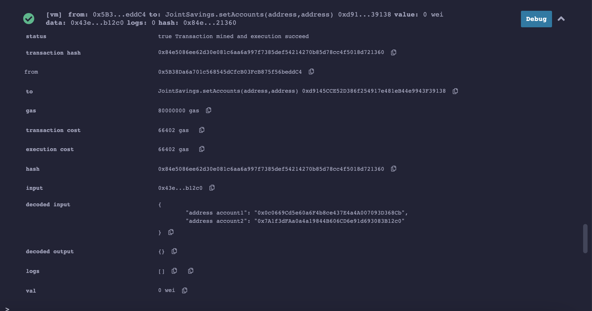

# JointSavings_SmartContract
This is the automation of joint savings accounts's setup. It is a solidity smart contract that accepts two user addresses that are then able to control a joint savings account. The smart contract will use ether management functions to implement various requirements from the financial institution to provide the features of the joint savings account.

## Technologies
We will using Remix IDE open source web application to compile, deploy and test our Smart Contract. 

* <https://remix.ethereum.org/>

 
## Usage

* Clone the repository.

* Open it in Remix IDE

For demonstration purposes we use JavaScript VM sandbox to deploy aor SmartContract and 2 Ethereum dummy addresses from Vanity-Eth vanity address generator.

See the video below how it works

[SmartContract in action](ExecutionResults/Recording.mov)

When the transaction is successful the hash will be created:

There are some transaction made with this Smart contract the resulting pictures of which you can find in Execution result folder.

Transaction 1: Send 1 ether as wei.

Transaction 2: Send 10 ether as wei.

Transaction 3: Send 5 ether.

    Set accounts one and Two

Withdrawing 5 ether into accountOne. 

Withdrawing 10 ether into accountTwo.

## Contributor

Nara Arakelyan
n_arakel@yahoo.com

---

## Licence 

UC Berkley
    
